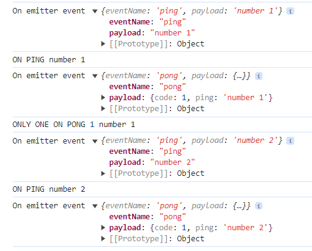

# EventEmitter

It is an event emitter object with an event type declaration.

## Example

```ts
import { LiteEventEmitter } from 'lite-utility';

const emitter = new LiteEventEmitter<{
  ping: string;
  pong: { code: number; ping: string };
}>();

const onPing = (value: string) => {
  console.log("ON PING", value);
  // Emit pong event
  emitter.emit("pong", {
    code: 1,
    ping: value,
  });
};
// Subscribe to the ping event.
emitter.on("ping", onPing);
const onPong = ({ code, ping }: { code: number; ping: string }) => {
  console.log("ONLY ONE ON PONG", code, ping);
  // Unsubscribe to the pong event.
  emitter.off("pong", onPong);
};
// Subscribe to the pong event.
emitter.on("pong", onPong);
// All events handler (onEmit is LiteEvent object).
emitter.onEmit.on((event) => {
  console.log("On emitter event", event);
});
// Emit first ping event.
emitter.emit("ping", "number 1");
// Emit second ping event.
emitter.emit("ping", "number 2");
// Unsubscribe from all emitter events.
emitter.unsubscribeAll();
// Unsubscribe from onEmit event (onEmit is LiteEvent object).
emitter.onEmit.unsubscribeAll();
// Emit third ping event.
emitter.emit("ping", "number 3");
```

Console output:



## Constructor

```ts
// EventsT is an events type schema.
constructor<EventsT>(
  params: {
    quiet: boolean // print console.error for error in on handler (default: false).
  }
) {}
```

## Fields

**onEmit**: ```LiteEvent<{
    eventName: string;
    payload: any;
}>``` - Event to handle all events.

:::warning

emitter.unsubscribeAll() doesn't do unsubscribe from onEmit event.

:::

## Methods

**emit**(_eventName_: ```string```, _payload_: ```any```): ```void``` - Emit an event.

**on**(_eventName_: ```string```, _handler_: ```(payload: any) => void```): ```void``` - Subscribe to an event by name.

**once**(_eventName_: ```string```, _handler_: ```(payload: any) => void```): ```void``` - Subscribe to an event by name, and handler works only once.

**off**(_eventName_: ```string```, _handler_: ```(payload: any) => void```): ```void``` - Unsubscribe from an event by name and handler.

**unsubscribeAll**(): ```void``` - Unsubscribe from all events.
 