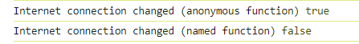

# Event

It is an event object for sending and receiving events.

## Example

```ts
import { LiteEvent } from "lite-utility";

const internetEvent = new LiteEvent<boolean>();

// Subscribe to the event by anonymous function.
internetEvent.on((connected) => {
  console.log("Internet connection changed (anonymous function)", connected);
});

// Emit an event.
internetEvent.emit(true);

// Unsubscribe all handlers.
internetEvent.unsubscribeAll();

// This event won't be processed in anonymous function.
internetEvent.emit(false);

const internetHandler = (connected: boolean) => {
  console.log("Internet connection changed (named function)", connected);
};

// Subscribe to the event by named function.
internetEvent.on(internetHandler);

// This event'll be processed in named function.
internetEvent.emit(false);

// Unsubscribe only one handler by its name.
internetEvent.off(internetHandler);

// This event won't be processed in named function.
internetEvent.emit(false);
```

Console output:



## Constructor

```ts
// PayloadT is an event type schema.
constructor<PayloadT>(
  params: {
    quiet: boolean // print console.error for error in on handler (default: false).
  }
) {}
```

## Methods

**emit```<T>```**(_payload_: ```T```): ```void``` - Emit an event.

**on```<T>```**(_handler_: ```(payload: T) => void```): ```void``` - Subscribe to an event by name.

**once```<T>```**(_handler_: ```(payload: T) => void```): ```void``` - Subscribe to an event. Works only once.

**off```<T>```**(_handler_: ```(payload: T) => void```): ```void``` - Unsubscribe from an event by handler.

**unsubscribeAll**(): ```void``` - Unsubscribe from all handlers.
 